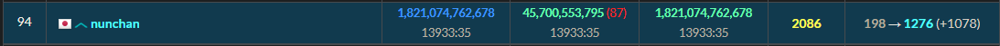
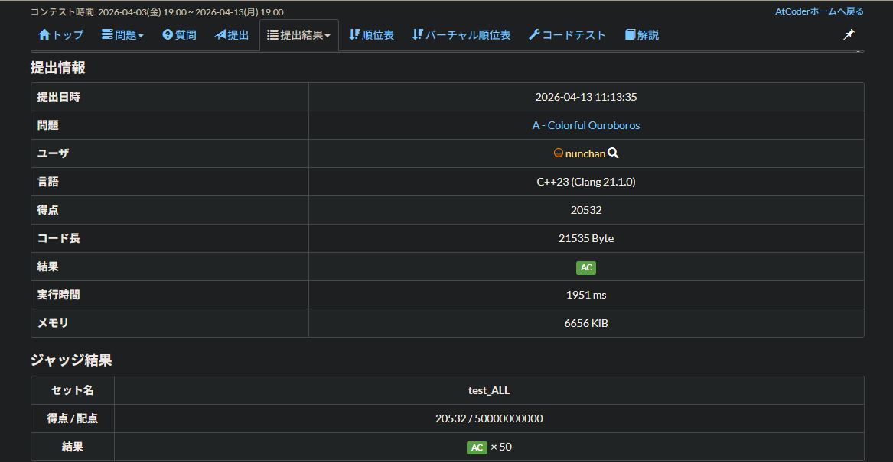

# AHC 063 参加記録
今後のコンテストや最適化問題にも通じるものがあると思うので、反省と今後の改善としてAHC 063の取り組み方を書き残す。
今回初めて長期ヒューリスティックコンテストに参加したので、色々と学べる所があった。
問題の考え方、取り組み方の工夫、新たな知識、苦労したことなど。

## 目次
* [1. 最終結果](#1-最終結果)
* [2. 問題の考察](#2-問題の考察)
* [3. 取り組み方の工夫](#3-取り組み方の工夫)
* [4. 苦労したこと](#4-苦労したこと)
* [5. 今後の課題](#5-今後の課題)

___

## 1. 最終結果

画像の通り、結果は90位でスコアは20532、パフォーマンスは2102、レートは水色になりました。

___

## 2. 問題の考察
### 2.1 まず初めに考えたこと
まずは問題文のルールと制約を良く見る。
これはどんな問題でも最初にやる当たり前だけど重要なこと。
要件定義の中でできそうな計算量を推測し、アルゴリズムを考える。

制約は、盤面は最大16×16マス、餌の数は最大3×マスの数/4、色の数は最大7色。
盤面自体は大きくない。しかし、餌の数が盤面の8割程埋まり、色の数も多くなると正解の色を集めるのが難しくなる。
そうなると数十手先を見るのが良さそうと考えた。

まずはビームサーチ(BS)から始めた。

### 2.2 BS
最初はとりあえず動くプログラムを書こうと実装を進めた。
ビーム幅を少しずつ調整し、どれくらいが良さそうかを調べながら進めた。
手動でビーム幅を調べるのは限界があり、非効率なので自動で調べながら行った。
また、この時は全てのケースで全ての色を揃える完走は不可能だと考えていた。
なので、もし完走できなかったら(1.8sec経ったら)単純な蛇行解を出力するようにした。

ここまでで1000万強点のスコアだった。

### 2.3 高速化
次に計算量がボトルネックとなり、解を得る前に打ち切られている可能性があると考えた。
実際、実行時間を延ばしてみると解が得られるケースがあったので、計算量の最適化が必要だった。
まず、Pythonでなるべく早いコードを書いていたが、言語的な限界があると感じC++に移行した。
ここで問題になったのが、C++の習熟度である。
普段はPythonを使っており、C++は文法は分かるが書き慣れていない。
なので、この辺から本格的にLLMでコード生成を行った。

この高速化で400万強点のスコアになった。

### 2.4 ノイズを与える
次に行ったことの前に気づいたことが1つあった。
それは解が得られるときは大抵300ms以下くらいで得られることである。
つまり、どんなにビームサーチを行っても、計算量の観点からビーム幅の制限がある状態では、最適解を見つけるのが不可能なケースがあると考えた。

そこで、次に行ったのがノイズを与えることである。
具体的には、3.5sec毎に再度解を見つける処理を行い、その度にノイズを与え多様性を持たせることである。
これによって毎回違ったビームサーチを行うことができ、完走にありつける可能性が増える。
また、そのリセマラを行う中でベストな解を探すこともでき、既存の解けていたケースの改善も期待できる。

このノイズを与えることによって、100万強点のスコアになった。

### 2.5 ハイパーパラメータの追加
次に行ったことはより複雑な探索ができるようにすることである。
そのためにハイパーパラメータを追加した。
具体的には、以下の状況に対して固定のペナルティを課すことにした。
- 胴体を壁として扱い、壁に囲まれる状況
- 嚙みちぎり
- 正解の色ではないゴミを食べる
これによってなるべく無駄なターン数を踏むのを避けるようにした。
更に以下のパラメータを閾値内でランダムに割り当てるように変更した。
- ビーム幅 (10~50)
- 探索ノイズ (100~2000)

このパラメータ追加により最高3万程度のスコアになった。
しかし、どのパラメータが良いかは問題ごとに異なり、ランダム性が強く不安定だった。

### 2.6 更にハイパーパラメータの追加と安定化
次に行ったことは更にハイパーパラメータのランダム化、試行回数増加による安定化である。
先ほど固定値で追加したパラメータとターン数に対するペナルティをランダム化して追加した。
ジェネレーター・ビジュアライザーを使って、最大ケース(16×16盤面、餌の数192、餌の種類7)で実行し、良さそうな閾値を人手で決定した。
最大ケースに絞った理由は最大ケースで解けないケースがいくつかあり、おそらくテストケースで解けていないのも似たケースだと予想したため。

さらに試行回数を増やすために、任意のターン数をかけても正解の色が進まない場合は、失敗ケースとし打ち切りを行った。
また、それまでのベストターン数を越える時点で打ち切るのも行った。
これによって試行回数がかなり増え、より短いターン数や完走が増えた。

最高スコアは2.5万程度で改善が見られた。しかし、まだまだ安定はしておらず、解けないケースもあることは分かっていた。

### 2.7 更に安定化のために2つのモードの追加
次に行ったことはパニックモードとブルドーザーモードの追加、クラスターの探索である。
餌の配列によっては上手くいかないケースがあり、そういったケースには盤面のリセットが有効だと考えた。
つまりターン数をいくらかかけても問題を別問題に置き換え、完走できるようにした。
2つのモードの説明は以下の通り。
- パニックモード: ペナルティを無視して好きなように動く。噛みちぎりが発生した時点でモード終了する。
- ブルドーザーモード: クラスター(正解の色の群生地)に向けて突っ込む。嚙みちぎりが発生した時点でモード終了する。
この2つのモードは任意のターン数分、正解の色が進まない場合に移行するようになっている。
これによって問題のリセットとその分を取り返すためのクラスターを探すようにした。
クラスターの探索は通常から行っていると計算量が膨大になるため、ブルドーザーモードのみに行うようにした。

### 2.8 難易度概念の導入
次に行ったことは問題によって難易度を設定し、その難易度によってパラメータを調整することである。
具体的には、初めに標準的な固定のパラメータを0.3sec実行し、解の出来具合によって難易度を3段階から決める。
解けた上で2000ターン未満であればEasy、2000ターン以上であればNormal、解けなかったらHardとした。
これによって、問題ごとの最適化ができ、より安定化と最適化ができた。

最終的にこの調整で最終スコアである20532を達成した。

### 2.9 Chunk Search
この戦略は結果的に最終スコアに到達した訳ではないが、別の解法として導入してみた戦略である。
具体的には任意の正解の進行度毎に最短ターン数をリランキングし、上位K個を次の探索ルートとして残し、それを再度任意の進行度まで進めるというのを繰り返す戦略である。

これによって最終スコアに近いスコアは達成できたが、試行回数がかなり減ったためあまり安定はしておらず、コンテスト終盤だったため、この戦略を最適化するのは諦めた。

___

## 3. 取り組み方の工夫
### 3.1 ジェネレーター・ビジュアライザーの利用
[AHC063 入力ジェネレータ・ビジュアライザ](https://img.atcoder.jp/ahc063/EbfTtMTp.html?lang=ja&_gl=1*3adide*_ga*OTA5NDI3NjIxLjE3NjU0MjYzMzk.*_ga_RC512FD18N*czE3NzYwNzQ2NDYkbzMzOSRnMSR0MTc3NjA4NzE2OSRqNTgkbDAkaDA.)

このツールには大変お世話になった。
毎回のヒューリスティックコンテストにあるが、考察にかなり役立ち、これを使わない手は無い。
どこで上手くいっていないのかや、手動による良い動きの検証などができる。
あと単純に見ていて面白い。
今回はWeb上で使ったが、ローカルで使用する事もでき、更なる自動化、効率化が可能である。

### 3.2 ノートに案を書き記す
当たり前かもしれないが、気になったことはすぐに書き留めるようにしていた。
頭の中でいくつも考えると忘れてしまったり、元の趣旨とずれたり、考えがまとまりづらかったりする。
どうしたら良さそうか、なぜそう思うのか、期待すること、絵で描いてみるといったことを書いていた。

### 3.3 生成AIを使った壁打ち
私は普段Pythonを中心に使っているため、たまに何をしているか分からないことがある。
そういった分からないことは放置して、AI頼りにしていると全然思ったコードを書いたりすることができない。
生成したコードはしっかりレビューし確認することを怠らないのは大事である。
また、アイデアの壁打ち役としても生成AIは優秀である。
ただ単純にAIの意見を聞くだけだと大抵上手くいかない。
「ここがこうだからこうなのでは？」「こうしたら良いと思うが認識は合っているか？」といった内容で、具体的に聞くことを心がけた。
これによってより深いアイデアを思いついたり、アイデアの取捨選択を行う事が出来たと思う。

生成AIはあくまで自分の補佐役でAIをメインにするのはやはりだめだと再×N実感した。
私は普段生成AIをどうしても分からないときに聞いて、自分で解決する方法を使っているが、今後もその方針で行こうと思う。

___

## 4. 苦労したこと
### 4.1 言語
まずは何と言っても言語の差である。
Pythonは実行時間が多くかかり、C++との差はかなり大きい。
C++を理解し、書くのがかなり大変だった。
基本的な文法レベルでは特に問題なかったが、複雑なコードになると一気に読みづらさ・書きづらさが増し、コード量も増えるため、頭がかなり疲れた。
今後のヒューリスティックコンテストに備えてC++は勉強しておくべきだと思った。

### 4.2 解法の限界
今回に関わらず、ヒューリスティックコンテストや最適化問題全般に言えるが、完全な最適解を得ることはほぼ不可能である。
なので、上限近くに来ると全然改善できなくて、一気にしんどさが増す。
2.2万点あたりから全然変わらなくてかなりきつかった。
おそらくそこからの戦略を10個近く考えたが、ほとんどが没になったし、改善幅が小さくて達成感があまりなかった。
また、後半は順位がどんどん抜かされたので、メンタル的に大変なのも実感した。
しかし、実際黄色パフォは普通にすごい部類だと思うので、自信持って次のコンテストもあまり他と比較しすぎず頑張ろう。

## 5-今後の課題
箇条書きで以下にまとめる。
- C++学習
- より高度なアルゴリズムの学習
- 軽量化、見やすいコードの学習
- 思いついたことを高速に書く実装力
- ランダムテスト用のコードを作って事前にどういったケースに強い・弱いのかを調査